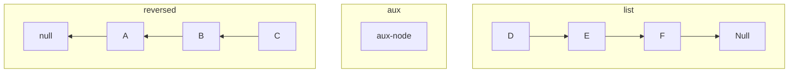
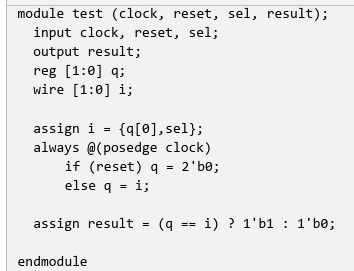
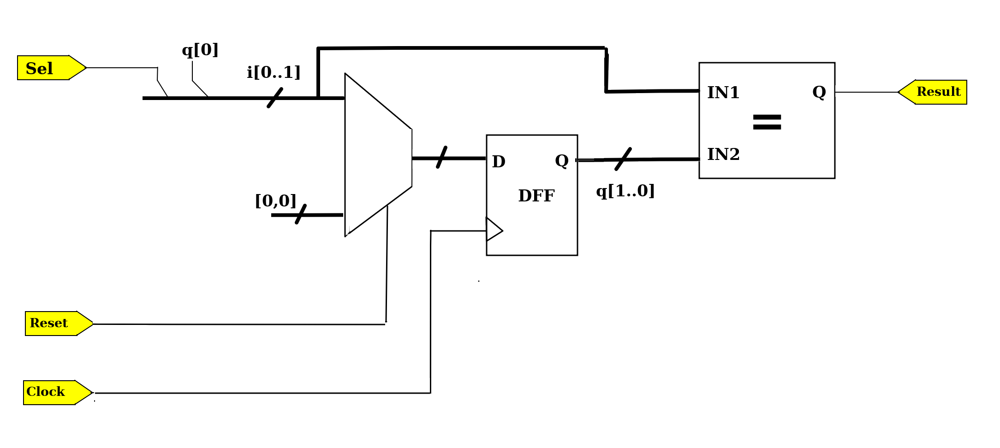
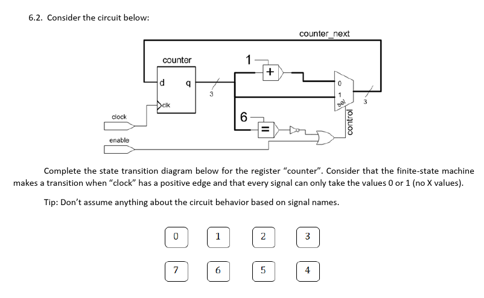
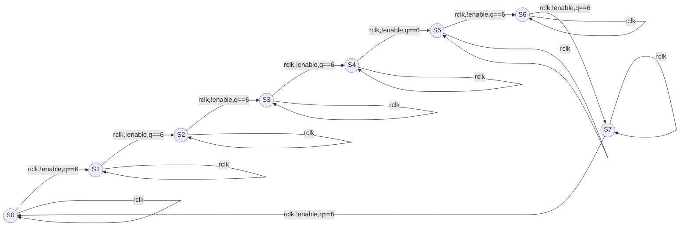
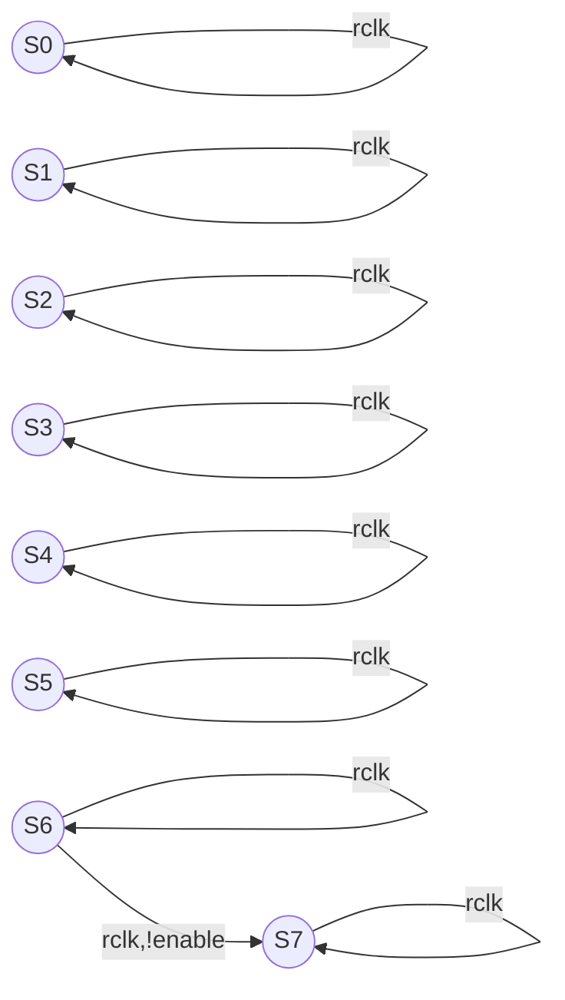
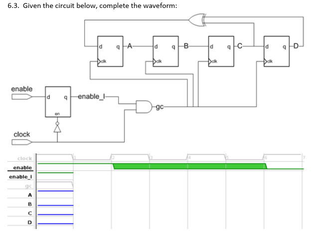
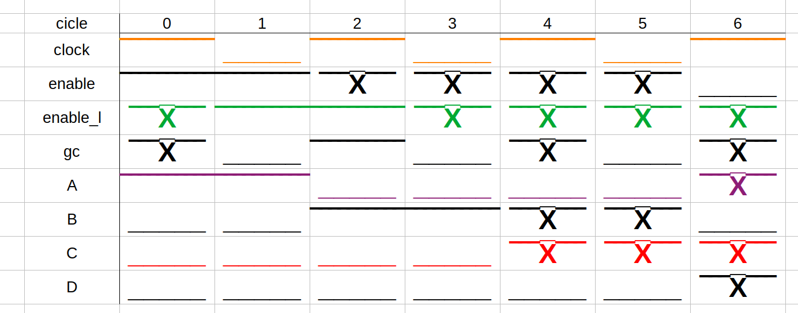
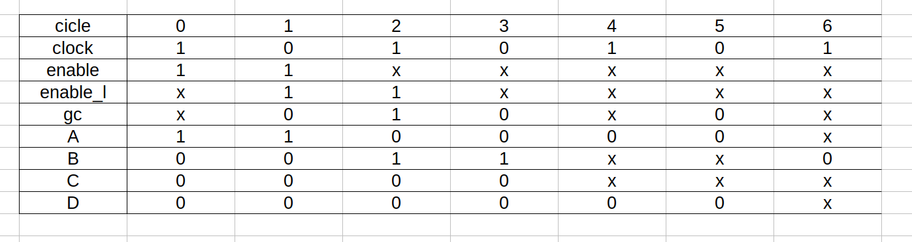

1. Linked list reversal
You need to return a list with the elements in the reverse order. Describe an algorithm, for the generic case of a list containing N elements that would do such work in a linear time complexity.


**Answer:**
As it is not required to preserve the original list, it reverts and doesn't preserve the original one.
The algorithm consists of 3 pointers that separates the set of nodes in 3 partitions:
 - list: points to the beginning of forward direction list partition
 - aux: points to the node to be transferred to a reverted list
 - reversed: stores a partition with nodes pointing in the backward direction

The algorithm works as iteratively removes a node from forward direction partition and inserts
on reverted order partition, then iterating over N nodes. For each node it swaps its
partition and updates the pointers of each partition.

```
function list reversal <- list
Let aux <- list
Let reversed_list <- null
While list != nil:
   aux_pointer <- list
   list <- list->next
   aux->next = reversed_list
   reversed_list <- aux
return reversed_list
```

<div style="page-break-after: always"></div>

Cpp implementation:
```c++
Node *list_reversal(Node *linked_list) {
  Node *reversed_list;
  Node *aux = linked_list;
  reversed_list = nullptr;
  while (linked_list != nullptr) {
    aux = linked_list;
    linked_list = linked_list->next;
    aux->next = reversed_list;
    reversed_list = aux;
  }
  return reversed_list;
}

```
---
1.2. You are developing a function to find an element in an array. The number of elements of the array is unknown and
the elements are sorted. If you access a position out of the bounds of the array, an exception is thrown. Describe an efficient algorithm to search an element.


**Answer:**
If it allowed to catch exceptions, then is possible to implement an
exponential search to find an element greater than following with a binary search:

```
Let array Array of unknown number of n elements
Let x the element to be found

let unbounded_exponential_search <- Array, x
  Let index i of element x to be find
  let index half be 1
  let index double be 1

  try:
    while x>A[double]:
        half <- double
        double <- 2*double
  except:
    new_array <- address(Array[half])
    return unbounded_exponential_search(new_array, x)

  return binary_search(A, half, double, x)

let binary search <- Array, lower, upper, x
  mid = floor((lower+upper)/2)
  if x > Array[mid]:
    return binary_search(Array,mid,upper,x)
  if x < Array[mid]:
    return binary_search(Array,lower,mid,x)
  return mid

```
If the doubling step tries to access an index out of the array, then it catches an exception and starts another search,
starting from the last try.

```
If it is not allowed to thrown exceptions, then the only solution that ensures to
not access an outside index of array is a linear search:
```

```
Let array A with n elements
Let element x to be find
let index i

while x>A[i]:
  i <- i+1

return i
```

---

1.3. Consider the following graph:
a)Starting on node 1, and always visiting nodes from left to the right:
i. Write the numbers corresponding to the nodes in the order that they would be visited if a BFS was used
```
[1],[3,2,4],[6],[5],[7,8],[10,9],[11]
[1,3,2,4,6,5,7,8,10,9,11]
```
ii. Now do the same using a DFS
```
[1,3,6,7,10,11,8,9,2,4,5]
```
Describe an algorithm that could be used to find a path between two nodes of this graph. Give a high-level explanation of it and justify why you chose it


**Answer:**
To find the path, we can use the Breadth first search and then construct the path.

The algorithm consists of finding the desired element in each adjacent vertex. If it
isn't there, then queue all adjacent vertex if there is still vertices to search.
For each adjacent vertex apply the same: searching over and queueing its neighbors, excluding vertex already visited, flagged by
visited nodes map. After searched over all neighbors vertexes then dequeue.
The path can be reconstructed by the vertices at the queue.

Do the same for an algorithm which finds the shortest path


**Answer:**
To find the shortest path, we can use, the Breadth first search path described before. Since it is a unweighted
graph. BFS-path increments its frontier of explored vertices each iteration, adding all vertex of
frontier on its queue, flagging the already visited. The reconstructed path is the shortest path, since the frontier is build incrementally.
The shortest path will be stored at the queue.

Do the same for an algorithm which finds the shortest path going through a specific node

**Answer:**
We can construct applying the shortest method path twice: first to the specific vertex, then
appending the path of specific vertex to the end desired vertex.

<div style="page-break-after: always"></div>

# 2. Software Design
2.1 The following class, SimpleJobDispatcher, implements part of a simple job dispatcher to a computer farm. After some time, you find that the SimpleJobDispatcher has poor performance because jobDisp.dispatch() frequently asks the Farm Manager to create slots for new jobs. What steps could you take to improve SimpleJobDispatcher’s performance?
```
class SimpleJobDispatcher {
  public static void main (String [] args) throws IOException {
    JobDispatcher jobDisp = new JobDispatcher ();
    for (; ; ;) { // just an illustrative loop
      Job job = jobDisp.dispatch();
      DoSomeProcessing(job);

  }
}
```

**Answer:**
Instead of using pooling to dispatch new requested jobs, it could be used asynchronous
dispatch, so as soon a new job is requested, it can be dispatched. Other options are
implementation of queues. Or job schedulers, so it can be defined the frequency to
dispatch jobs.

---
2.2 Suppose you need to develop a software that contains a database manipulated by an arbitrary set of routines. This database is also read by many other components of the software to do component-specific calculations, as the figure shows:
Based on the architecture shown above:
a) Describe a way that the components could be aware of any changes in the database without querying it periodically.

**Answer:**
It could be used an producer-subscriber architecture, where components listen to the changes of states of the database. Then, when a change in the database occur, there is a notification to the subscribed listeners.

b) How would you improve solution you proposed in a) to handle concurrent access to the database?

**Answer:**
Should have mutual exclusion implemented by atomic transactions on operations in the
database, where during processing of events, the state of the database stays consistent.

<div style="page-break-after: always"></div>

2.3 You have a program written in C language that allocates a huge array of integers. You would like to initialize all the entries to 0, but the length of the array is too big, and you have to avoid the linear time complexity of initialization. Design a deterministic scheme by which reads and writes to the array can be made in constant time complexity
and assures that read operations always get initialized values. Assume memory consumption is not a constraint.
```c
int *array = (int*) calloc(ARRAY_SIZE*size_of(int));
int *initialized_map = (int*) calloc(ARRAY_SIZE*size_of(int));

int write(int value, int index){
  if(index>ARRAY_SIZE) return -1;
  initialized_map[index] = TRUE;
  array[index] = value;
  return 0;
}
int read(int index){
  return (initialized_map[index])? array[index] : -1;
}
```

<div style="page-break-after: always"></div>

# 3. C Language
3.1. Locate bugs in the following program:
```c
#include <stdio.h>
#include <stdlib.h>
#include <string.h>
#define BUFF_SIZE 100
char *function1(const char *str) {
  char buff[BUFF_SIZE];   // BUG!
  int i;
  size_t strSize = strlen(str);
  for (i = 0; i < strSize && i < BUFF_SIZE; i++) {
    char c = str[i];
    if (c >= 'a' && c <= 'z') {
      c = (c - 'a') + 'A';
    }
    buff[i] = c;
  }
  return buff;         // BUG!
}
int main() {
  char *msg = "Hello world!";
  char *ptr;
  printf("String Fun!\n");
  printf("Original msg is %s\n", msg);
  ptr = function1(msg);
  printf("ptr is %s\n", ptr);
  printf("msg is %s\n", msg);
  return 0;
}
```
**Answer:**
Bugs:
- buff variable exists inside of the scope of the function. It should be memory allocated instead.

<div style="page-break-after: always"></div>

---
3.2. Locate bugs in the following program:

```c
typedef struct List {
  int *data;
  struct List *next;
} listT;
void cleanList(listT *myListP);
void doSth();
int condition();
void main() {
  listT *myListP = NULL;
  if (condition()) {
    cleanList(myListP);
  }
  if (myListP != NULL) {
    doSth();
  }
}
void cleanList(listT *myListP) {
  while (myListP != NULL) {
    free(myListP);              //Bug! Freeing this node will make next ones loose
    myListP = myListP->next;    //Error: myListP was deallocated
  }
}
```

**Answer:**
Bug in freeing node before save the next ones. And segfault while accessing unallocated
myListP.


<div style="page-break-after: always"></div>

---
3.3. Note the performance issues with the following code

```c
#include <stdlib.h>
#include <string.h>
char *my_strchr(const char *str, char C) {
  int loop = 0;
  while (str[loop] != '\0') {
    if (str[loop] == C)
      return &str[loop];
    loop++;
  }
  return NULL;
}
int some_function(const char *string) {
  int loop;
  int numA = 0;
  for (loop = 0; loop < strlen(string); loop++) {
    if ((char *)NULL != my_strchr(string[loop], 'A'))
      numA++;
  }
  return numA;
}
```
**Answer:**
Performance issue: the previous code iterate over the string linearly twice to count
incidences of character 'A'. Running two nested iteration over the array has the complexity order of
$O(n^2)$.
The same count can be made with a single iteration, with complexity order of $O(n)$:
```
#include <stdlib.h>
#include <string.h>

int some_function(const char *string) {
  int loop;
  int numA = 0;
  for (loop = 0; loop < strlen(string); loop++) {
    if (string[loop] ==  'A') numA++;
  }
  return numA;
}
```

<div style="page-break-after: always"></div>

---
3.5. Which of the following gives the memory address of the first element in array?
```
(a) array [0]
(b) array[1]
(c) array(2)
(X) array   -> The C array is a pointer to the first element.
```

---
3.6. On freeing a dynamic memory, if the pointer value is not modified, then the
pointer points to.
```
(a) NULL
(b) Other dynamically allocated memory
(X) The same deallocated memory location     -> The memory was
deallocated, but it points to the same location.
(d) It points back to location it was initialized with
```
---
3.7. What is the type of variable ‘z’ in following code?
#include <stdio.h>
int main()
{
  int z;
}
```
(a) static variable
(X) automatic variable --> z is a local or from the hidden keyword 'auto'.
Which means it allocate memory automatically in that block and free
it upon exit from that block.
(c) register variable
(d) global variable.
```

<div style="page-break-after: always"></div>

# 4. C++ and STL
4.1. In STL, which are the main differences between a vector and a list?

**Answer:**
Vectors are a data structured which implementation is analogous to arrays, because they store elements in a
contiguous location. Whereas lists are similar to linked list, where it stores in a
non-contiguous location. The first can access elements with constant time, but deletion
and insertion in the mid are costly. The former realizes cheap insertion and deletions,
but costly iteration in comparison with vectors.

---
4.2. Suppose you need to count a list of the unique words that are read from an istream.
a) Write the prototype for the method you are going to create.
```C++
map<string, int> *words_freq(string s);
```
---
b) Which STL structure would you use to store the words?
**Answer:**
I would use an associative map that is a container that associates the key element pair. In this case, the key would be the unique word, and the value would be the count of this specific word.

<div style="page-break-after: always"></div>

---

c) Write the code to implement what is proposed in this problem.
**Answer:**
```c++
#include <iostream>
#include <sstream>
#include <map>
#include <string>
using namespace std;

map<string, int> *wordsCounting(string text) {
  map<string, int> *wordCount = new map<string,int>;
  stringstream wordStream(text);
  string word;

  while(getline(wordStream,word,' ')){
    (*wordCount)[word]+=1;
  }

  return wordCount;
}
```
```
Test
string text = "In Western musical theory, a cadence (Latin cadentia, 'a
falling') is the end of a phrase in which the melody or harmony creates a sense
of resolution. A harmonic cadence is a progression of two or more chords that
concludes a phrase, section, or piece of music. A rhythmic cadence is a
characteristic rhythmic pattern that indicates the end of a phrase. A cadence is
labeled like or less 'weak' or 'strong' depending on the impression of finality
it gives. While cadences are usually classified by specific chord or melodic
progressions, the use of such progressions does not necessarily constitute a
cadence—there must be a sense of closure, as at the end of a phrase. Harmonic
rhythm plays an important part in determining where a cadence occurs.";

return:
'a':11
'the':6
'cadence':5
'Harmonic':1
```

---

d) If you were not using the STL container mentioned in b), would you propose another alternative STL container or even develop another container? Which? (There is no need to write program, just an explanation)
**Answer:**
I would implement a container that is a map sortable by key. It is a usual map, but with a
method that vectorizes its keys and its values, then reordering the pairs keys:values by
its values. This method would abstract the extraction of most frequent words.

---

4.3. Consider the partial definition of the Student class below and the
FindCourseName method:
```c++
class Student {
  // many attributes and methods here plus:
  char *name;       // Student name
  char *courseName; // Student course name
  std::string toString() { return std::string(name); }
}

std::string
FindCourseName(std::list<Student> stu, string name) {
  for (std::list<Student>::iterator it = stu.begin(); it != stu.end(); it++) {
    if ((*it).toString() == name) {
      return it->courseName;
    }
  }
  return "";
}

```
a) How many unnecessary object creations/copies are done in the FindCourseName method?
b) How would you reduce this number of copies?
c) How would you optimize the code above?

**Answer:**
a) As the method FindCourseName is passing by value, thus copying the whole list.
b) The correct solution would be passing the list by reference:
```
std::string FindCourseName ( std::list< Student > &stu, string name )
```
c) To optimize the performance of finding the course of a given student name, it is
possible to implement a map of student:courses, then the search cost would be O(log(n))
instead of O(n).

---
4.4. Remove the errors and optimize the code below.

**Answer:**
```C++
typedef std::vector<std::string> StringVector;
// Const cannot be used, since we are changing the vector
// bool myMethod(const StringVector &input, StringVector &output) {
void myMethod(StringVector &input, StringVector &output) {
  StringVector::iterator first = find(input.begin(), input.end(), "Fabiano");
  StringVector::iterator last = find(input.begin(), input.end(), "Vector");
  *last = "Victor";
  for (StringVector::iterator it = first; it != last; ++it) {
    std::cout << *it << std::endl;
  }

  // input.insert(--(input.end()), "XXX"); // Editing original vector
  StringVector::iterator end = input.end();
  input.insert(--(end), "XXX");
  if (first != input.end())
    std::cout << *first << std::endl;
  // Vectorized operations runs faster than iterating over the vector
  //  for (StringVector::iterator it = input.begin(); it != input.end(); ++it) {
  //    output.push_back(*it);
  //  }
  // Appending input vector to the output vector
  output.insert(output.end(), input.begin(), input.end());
}
```

---
4.5 Consider the following C++ program:
```c++
#include <iostream>
using namespace std;

class MyClassOne {
  public:
    int calculate() { return 1; }
};
class MyClassTwo : public MyClassOne {
  public:
    virtual int calculate() { return 2; }
};
class MyClassThree : public MyClassTwo {
  public:
    int calculate() { return 3; }
};
int main() {
  int result = 0;
  MyClassOne *objs[3];
  objs[0] = new MyClassOne();
  objs[1] = new MyClassTwo();
  objs[2] = new MyClassThree();
  for (int i = 0; i < 3; ++i) {
    cout << objs[i]->calculate() << endl;
  }
  return 0;
}
```
What is going to be printed to the standard output?

**Answer:**
- obj[0] is an instance of ClassOne, then calculate() returns 1
- obj[1] is an instance of MyClassTwo, but its calculate() doesn't override from the base
class, because the former isn't virtual, then calls calculate from the base class,
returning 1
- obj[2] is an instance of MyClassThree, but its calculate() doesn't override from the base
class, because the former isn't virtual, then calls calculate from the base class,
returning 1

# 5. C++11
5.1. Describe what happens in the following code (suppose move constructors and operators are defined in BigInt class).
```c++
void swap(BigInt& a, BigInt& b) {
  BigInt t(move(a));
  a = move (b);
  b = move (t);
}
```

**Answer:**
This function swaps the references of objects pointed by the variables a and b, using move assignment operator overload. After executed, b have the previous content of a, and vice-versa.

---
5.2. Implement move constructor and operator for BigInt class. Consider the following initial description for the class:

```c++
class BigInt {
public:
  BigInt(unsigned len);
  BigInt(const BigInt &bi);
  BigInt(BigInt &&bi);
  BigInt &operator=(const BigInt &bi);
  BigInt &operator=(BigInt &&bi);
  int size() { return len_; }

  ~BigInt();

private:
  unsigned len_;
  uint8_t *mag_;
};
BigInt::BigInt(unsigned len)
    : len_(len), mag_(len ? new uint8_t[len] : nullptr) {}
BigInt::BigInt(const BigInt &bi)
    : len_(bi.len_), mag_(len_ ? new uint8_t[bi.len_] : nullptr) {
  std::copy(bi.mag_, bi.mag_ + len_, mag_);
}

// Move constructor implementation
BigInt::BigInt(BigInt &&bi) : len_(bi.len_), mag_(bi.mag_) {
  bi.mag_ = nullptr;
  bi.len_ = 0;
}

BigInt &BigInt::operator=(const BigInt &bi) {
  if (&bi == this)
    return *this;
  len_ = bi.len_;
  delete[] mag_;
  mag_ = len_ ? new uint8_t[bi.len_] : nullptr;
  std::copy(bi.mag_, bi.mag_ + len_, mag_);
  return *this;
}

// Move assingnment operator overload implementation
BigInt &BigInt::operator=(BigInt &&bi) {
  if (&bi == this)
    return *this;
  len_ = bi.len_;
  delete[] mag_;
  mag_ = bi.mag_;
  bi.mag_ = nullptr;
  bi.len_ = 0;
  return *this;
}

BigInt::~BigInt() { delete[] mag_; }
```


# 6. Hardware and Simulation

6.1. Draw the circuit that would be generated from the Verilog/VHDL description right below. Both descriptions are equivalent.





---
6.2.


**Answer:**
This FSM is stuck in any state except 6. When in state 6, it transition to 7,
then it stays. Demonstration:

Simplifying:


---

**Answer:**



